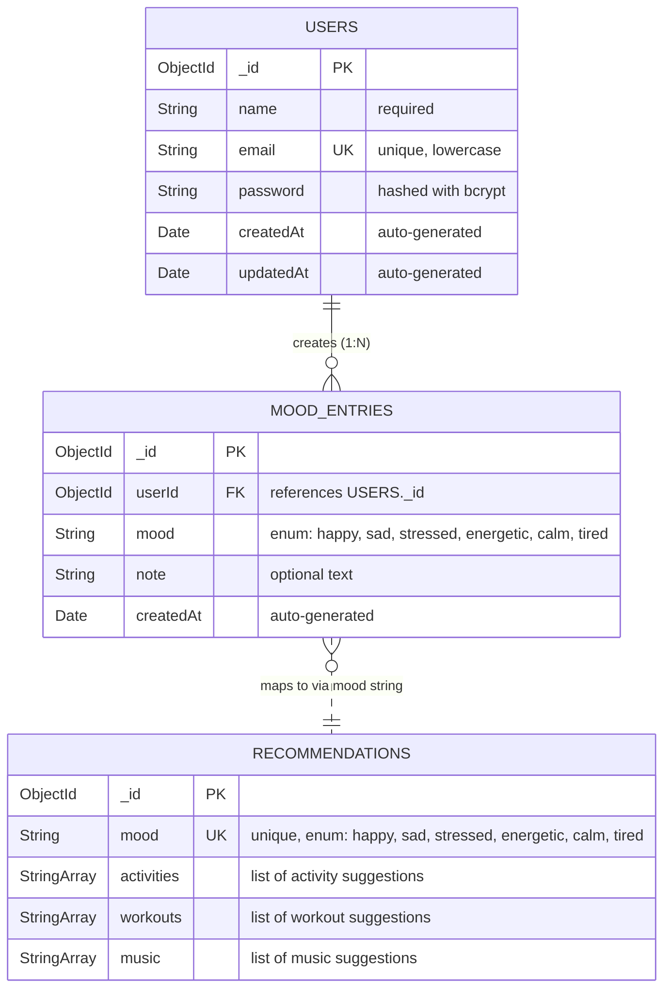

# ER Diagram



---

## Relationship Details

### Users → MoodEntries (One-to-Many)

- A single **User** can create many **MoodEntries** over time
- Each **MoodEntry** belongs to exactly one **User** via the `userId` foreign key
- Entries are stored as separate documents (normalized) rather than embedded, to avoid hitting MongoDB's 16MB document size limit as entries accumulate
- **Indexed:** Compound index on `{ userId: 1, createdAt: -1 }` for fast sorted queries

### MoodEntries → Recommendations (Soft Link via Mood String)

- **Recommendations** are not user-specific — they are a global lookup table
- The relationship is a **soft link** through the `mood` string field, not a traditional foreign key
- When a user logs a mood, the same `mood` value can be used to query the **Recommendations** collection for matching suggestions
- This design allows recommendations to be updated globally without affecting individual mood entries

---

## Indexing Strategy

| Collection | Index | Type | Purpose |
|------------|-------|------|---------|
| `users` | `{ email: 1 }` | Unique | Fast login lookups, prevent duplicate registrations |
| `moodentries` | `{ userId: 1 }` | Standard | Retrieve all entries for a specific user |
| `moodentries` | `{ userId: 1, createdAt: -1 }` | Compound | Efficiently fetch sorted mood history with pagination |
| `recommendations` | `{ mood: 1 }` | Unique | Fast recommendation lookup by mood type |

---

## Data Examples

### Users Document
```json
{
  "_id": "ObjectId('...')",
  "name": "John Doe",
  "email": "john@example.com",
  "password": "$2b$10$...",
  "createdAt": "2026-04-19T10:00:00Z",
  "updatedAt": "2026-04-19T10:00:00Z"
}
```

### MoodEntries Document
```json
{
  "_id": "ObjectId('...')",
  "userId": "ObjectId('...')",
  "mood": "stressed",
  "note": "Big exam tomorrow, feeling overwhelmed",
  "createdAt": "2026-04-19T15:30:00Z"
}
```

### Recommendations Document
```json
{
  "_id": "ObjectId('...')",
  "mood": "stressed",
  "activities": ["Practice deep breathing", "Meditate for 10 minutes", "Declutter your space"],
  "workouts": ["Yoga flow", "Tai chi", "Swimming"],
  "music": ["Nature sounds", "Ambient electronic", "Meditation tracks"]
}
```
