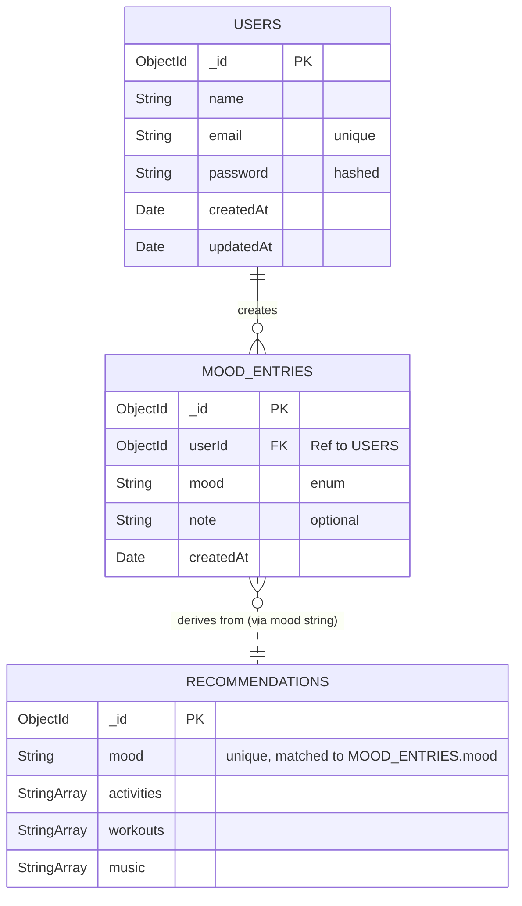

# AthletiCore ER Diagram

```mermaid
erDiagram

    USERS {
        ObjectId _id PK
        String name
        String email "unique"
        String password "hashed"
        Date createdAt
        Date updatedAt
    }

    MOOD_ENTRIES {
        ObjectId _id PK
        ObjectId userId FK "Ref to USERS"
        String mood "enum"
        String note "optional"
        Date createdAt
    }

    RECOMMENDATIONS {
        ObjectId _id PK
        String mood "unique, matched to MOOD_ENTRIES.mood"
        StringArray activities
        StringArray workouts
        StringArray music
    }

    USERS ||--o{ MOOD_ENTRIES : creates
    
    %% Note: Recommendations are a global lookup map tied to the string value of 'mood'
    %% It is not a direct foreign-key table map in the traditional relational sense unless mood itself is an entity.
    %% We represent the conceptual link below.
    MOOD_ENTRIES }o..|| RECOMMENDATIONS : "derives from (via mood string)"

```
