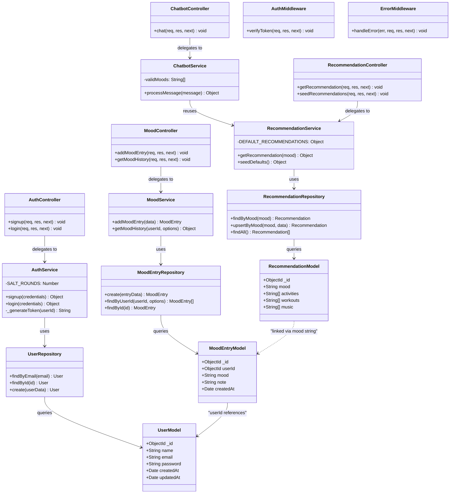

# Class Diagram



---

## Architecture Overview

The class diagram follows a strict **layered architecture** with clear separation of concerns:

### Layer Responsibilities

| Layer | Responsibility | Pattern |
|-------|---------------|---------|
| **Models** | Define MongoDB schemas and data structure | Mongoose Schema |
| **Repositories** | Encapsulate all database operations | Repository Pattern |
| **Services** | Contain all business logic | Service Layer Pattern |
| **Controllers** | Handle HTTP request/response only | Thin Controller |
| **Middleware** | Cross-cutting concerns (auth, errors) | Middleware Pattern |

### Design Patterns Applied

1. **Repository Pattern** — All database queries are encapsulated in repository classes, making it easy to swap data sources without touching business logic.

2. **Service Layer Pattern** — Business rules live exclusively in service classes. Controllers never contain logic beyond request parsing.

3. **Singleton Pattern** — All services and repositories are exported as singleton instances (`module.exports = new ClassName()`), ensuring a single shared instance throughout the application lifecycle.

4. **Dependency Flow:**
   ```
   Controllers → Services → Repositories → Models → MongoDB
   ```
   Each layer only communicates with the layer directly below it. No layer skipping is allowed.
