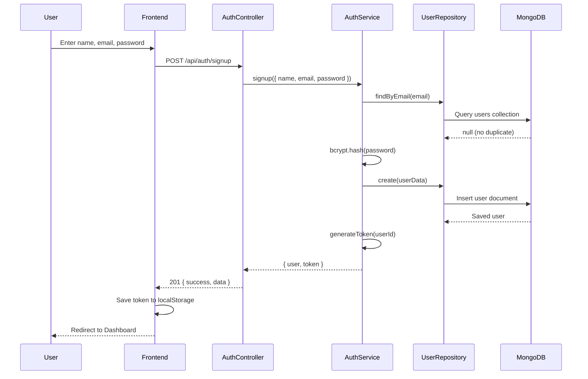
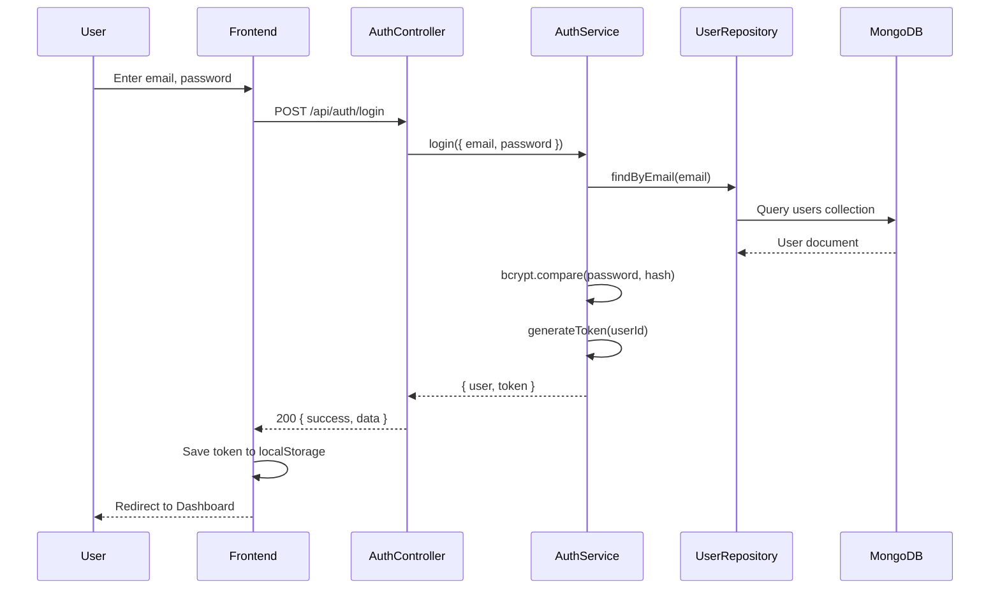
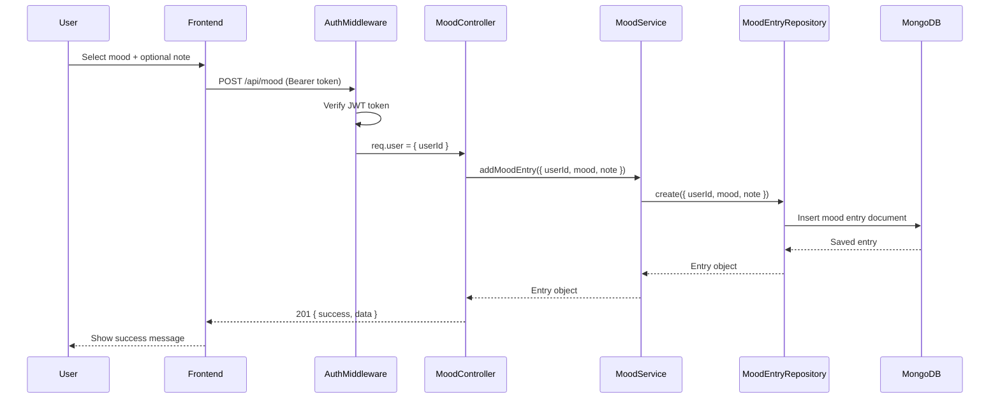
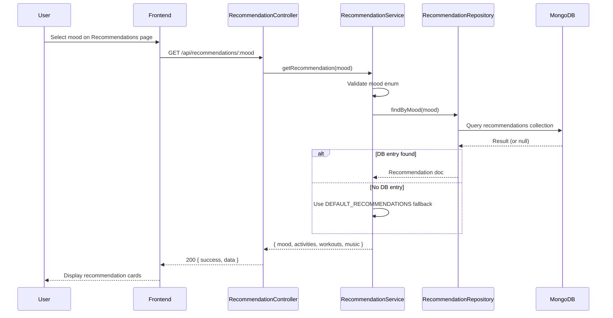
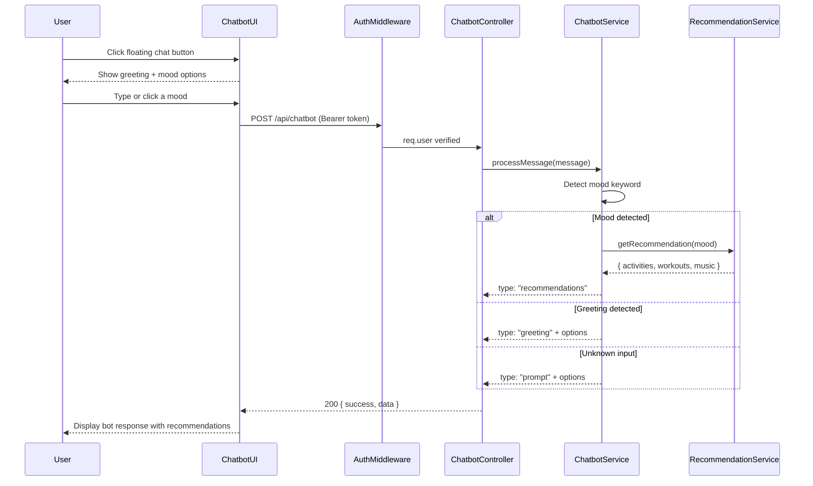

# Sequence Diagrams

## 1. User Signup Flow

```mermaid
sequenceDiagram
    participant User
    participant Frontend
    participant AuthController
    participant AuthService
    participant UserRepository
    participant MongoDB

    User->>Frontend: Enter name, email, password
    Frontend->>AuthController: POST /api/auth/signup
    AuthController->>AuthService: signup({ name, email, password })
    AuthService->>UserRepository: findByEmail(email)
    UserRepository->>MongoDB: Query users collection
    MongoDB-->>UserRepository: null (no duplicate)
    AuthService->>AuthService: bcrypt.hash(password)
    AuthService->>UserRepository: create(userData)
    UserRepository->>MongoDB: Insert user document
    MongoDB-->>UserRepository: Saved user
    AuthService->>AuthService: generateToken(userId)
    AuthService-->>AuthController: { user, token }
    AuthController-->>Frontend: 201 { success, data }
    Frontend->>Frontend: Save token to localStorage
    Frontend-->>User: Redirect to Dashboard
```

---

## 2. User Login Flow

```mermaid
sequenceDiagram
    participant User
    participant Frontend
    participant AuthController
    participant AuthService
    participant UserRepository
    participant MongoDB

    User->>Frontend: Enter email, password
    Frontend->>AuthController: POST /api/auth/login
    AuthController->>AuthService: login({ email, password })
    AuthService->>UserRepository: findByEmail(email)
    UserRepository->>MongoDB: Query users collection
    MongoDB-->>UserRepository: User document
    AuthService->>AuthService: bcrypt.compare(password, hash)
    AuthService->>AuthService: generateToken(userId)
    AuthService-->>AuthController: { user, token }
    AuthController-->>Frontend: 200 { success, data }
    Frontend->>Frontend: Save token to localStorage
    Frontend-->>User: Redirect to Dashboard
```

---

## 3. Log Mood Entry Flow

```mermaid
sequenceDiagram
    participant User
    participant Frontend
    participant AuthMiddleware
    participant MoodController
    participant MoodService
    participant MoodEntryRepository
    participant MongoDB

    User->>Frontend: Select mood + optional note
    Frontend->>AuthMiddleware: POST /api/mood (Bearer token)
    AuthMiddleware->>AuthMiddleware: Verify JWT token
    AuthMiddleware->>MoodController: req.user = { userId }
    MoodController->>MoodService: addMoodEntry({ userId, mood, note })
    MoodService->>MoodEntryRepository: create({ userId, mood, note })
    MoodEntryRepository->>MongoDB: Insert mood entry document
    MongoDB-->>MoodEntryRepository: Saved entry
    MoodEntryRepository-->>MoodService: Entry object
    MoodService-->>MoodController: Entry object
    MoodController-->>Frontend: 201 { success, data }
    Frontend-->>User: Show success message
```

---

## 4. Get Recommendations Flow

```mermaid
sequenceDiagram
    participant User
    participant Frontend
    participant RecommendationController
    participant RecommendationService
    participant RecommendationRepository
    participant MongoDB

    User->>Frontend: Select mood on Recommendations page
    Frontend->>RecommendationController: GET /api/recommendations/:mood
    RecommendationController->>RecommendationService: getRecommendation(mood)
    RecommendationService->>RecommendationService: Validate mood enum
    RecommendationService->>RecommendationRepository: findByMood(mood)
    RecommendationRepository->>MongoDB: Query recommendations collection
    MongoDB-->>RecommendationRepository: Result (or null)

    alt DB entry found
        RecommendationRepository-->>RecommendationService: Recommendation doc
    else No DB entry
        RecommendationService->>RecommendationService: Use DEFAULT_RECOMMENDATIONS fallback
    end

    RecommendationService-->>RecommendationController: { mood, activities, workouts, music }
    RecommendationController-->>Frontend: 200 { success, data }
    Frontend-->>User: Display recommendation cards
```

---

## 5. Chatbot Interaction Flow

```mermaid
sequenceDiagram
    participant User
    participant ChatbotUI
    participant AuthMiddleware
    participant ChatbotController
    participant ChatbotService
    participant RecommendationService

    User->>ChatbotUI: Click floating chat button
    ChatbotUI-->>User: Show greeting + mood options

    User->>ChatbotUI: Type or click a mood
    ChatbotUI->>AuthMiddleware: POST /api/chatbot (Bearer token)
    AuthMiddleware->>ChatbotController: req.user verified
    ChatbotController->>ChatbotService: processMessage(message)

    ChatbotService->>ChatbotService: Detect mood keyword

    alt Mood detected
        ChatbotService->>RecommendationService: getRecommendation(mood)
        RecommendationService-->>ChatbotService: { activities, workouts, music }
        ChatbotService-->>ChatbotController: type: "recommendations"
    else Greeting detected
        ChatbotService-->>ChatbotController: type: "greeting" + options
    else Unknown input
        ChatbotService-->>ChatbotController: type: "prompt" + options
    end

    ChatbotController-->>ChatbotUI: 200 { success, data }
    ChatbotUI-->>User: Display bot response with recommendations
```
