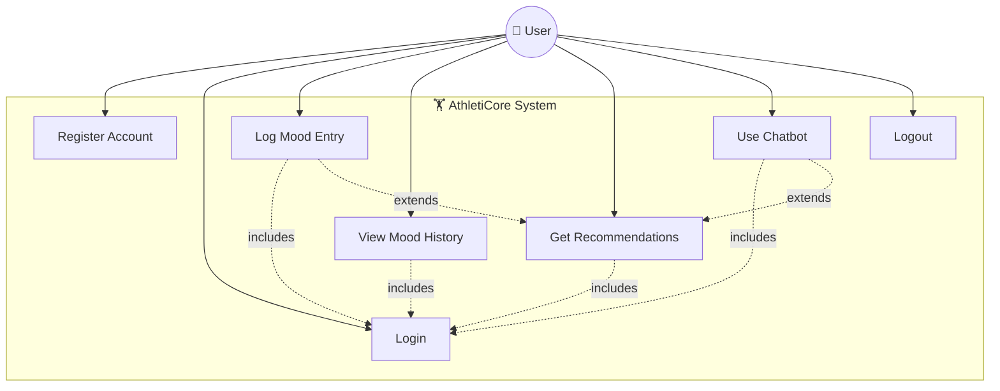

# Use Case Diagram

---

## Use Case Descriptions

### UC1: Register Account
- **Actor:** User
- **Precondition:** User does not have an existing account
- **Flow:**
  1. User navigates to the Signup page
  2. User enters name, email, and password
  3. System validates input and checks for duplicate email
  4. System hashes the password and creates the user record
  5. System generates a JWT token and redirects to the Dashboard
- **Postcondition:** User account is created and authenticated

### UC2: Login
- **Actor:** User
- **Precondition:** User has a registered account
- **Flow:**
  1. User navigates to the Login page
  2. User enters email and password
  3. System validates credentials against the database
  4. System generates a JWT token and redirects to the Dashboard
- **Postcondition:** User is authenticated with a valid session token

### UC3: Log Mood Entry
- **Actor:** User (authenticated)
- **Precondition:** User is logged in
- **Flow:**
  1. User navigates to the Mood Input page
  2. User selects a mood from the visual selector (happy, sad, stressed, energetic, calm, tired)
  3. User optionally adds a text note
  4. System stores the mood entry with a timestamp
  5. System displays a success confirmation
- **Postcondition:** Mood entry is saved in the database

### UC4: View Mood History
- **Actor:** User (authenticated)
- **Precondition:** User is logged in
- **Flow:**
  1. User views the Dashboard or Mood Input page
  2. System fetches the user's mood entries sorted by most recent
  3. Mood entries are displayed as cards with emoji, mood label, note, and timestamp
- **Postcondition:** User can see their historical mood data

### UC5: Get Recommendations
- **Actor:** User (authenticated)
- **Precondition:** User is logged in
- **Flow:**
  1. User navigates to the Recommendations page
  2. User selects a mood type
  3. System fetches recommendation data (DB-first with rule-based fallback)
  4. System displays recommended activities, workouts, and music
- **Postcondition:** User receives mood-specific recommendations

### UC6: Use Chatbot
- **Actor:** User (authenticated)
- **Precondition:** User is logged in
- **Flow:**
  1. User clicks the floating chat button (💬)
  2. Chatbot greets the user and asks how they are feeling
  3. User types a mood or selects from mood option buttons
  4. Chatbot responds with personalized recommendations inline
  5. User can continue the conversation or close the chat
- **Postcondition:** User receives recommendations via conversational interface

### UC7: Logout
- **Actor:** User (authenticated)
- **Precondition:** User is logged in
- **Flow:**
  1. User clicks the Logout button in the Navbar
  2. System clears the JWT token and user data from localStorage
  3. User is redirected to the Login page
- **Postcondition:** Session is terminated
